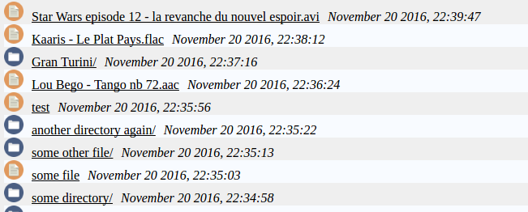

# directory-list.php

## Overview

Quick PHP hack to list directories and files from the directory it's in (by descending modification date).
It is secure (url and filename should be stripped, filtered the '.' and '..' directories).

## Installation

To make it work, you first need a HTTP server with PHP. If you have those requirements put the directory in the folder you want to share (it has to be accessible via HTTP).

You also can also easily modify the PHP file to take files from elsewhere in your server.

## TODO

The CSS could be improved, might do it in the future.

I'm not really investing time (nor have I) on this because I already have another project which should cover the same usecases.

## Notes

The directory icon is a work from David Cross, from [Webhosting Media](http://webhostingmedia.net/), recuperated via [iconfinder.com](https://www.iconfinder.com/).
